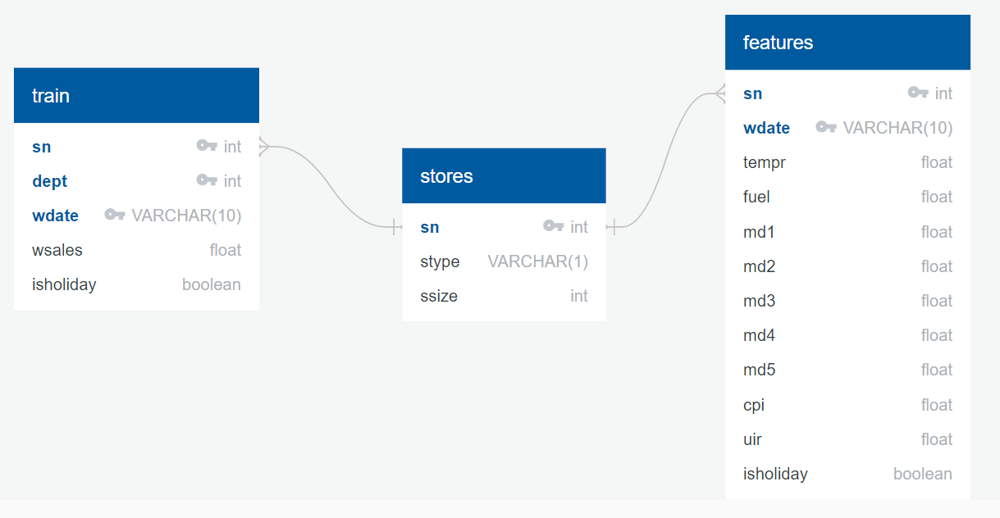
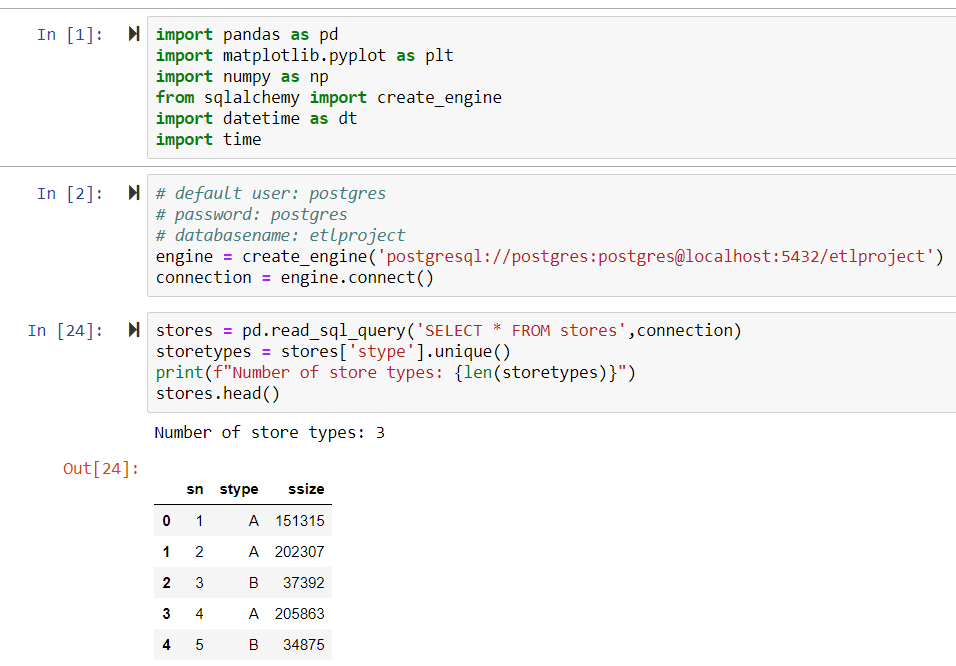
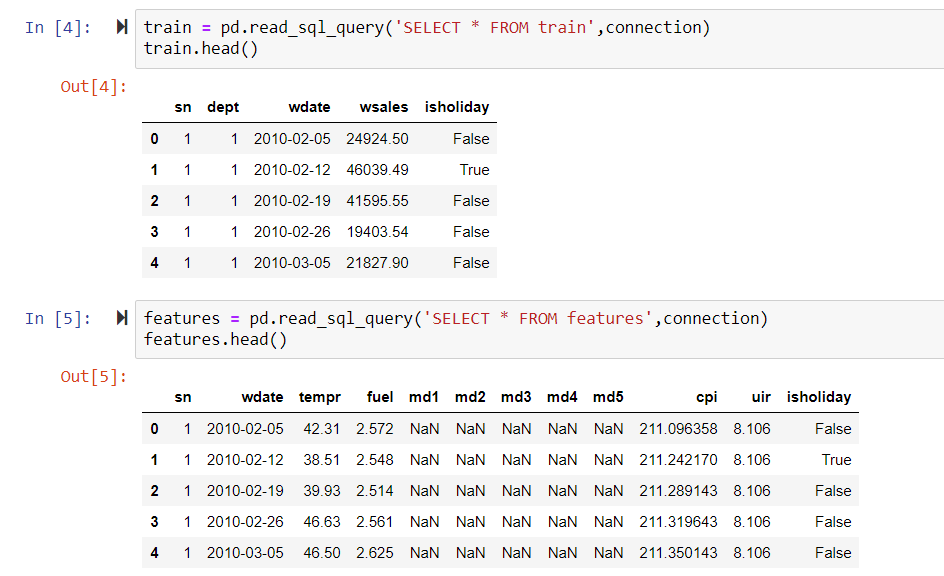
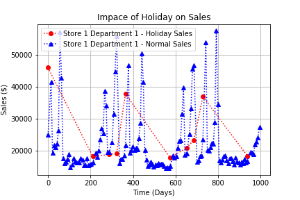

# ETL Project

Group Members: Amgad Nassif, Daewon Kwon, Gabriella Geron, Taimoor Arshad

1. [Selection of Datasets](#selection-of-datasets)
2. [Description of Datasets](#description-of-datasets)
3. [Selection of Database](#selection-of-database)
4. [ERD](#erd)
5. [Loading into PostgresSQL](#loading-into-postgressql)
6. [Confirmation of Data Integrity](#confirmation-of-data-integrity)

***

## Selection of Datasets

Source: [Kaggle - Store Sales Forecasting competition by Walmart](https://www.kaggle.com/c/walmart-recruiting-store-sales-forecasting/data)

[Back to top](#etl-project)

***

## Description of Datasets

* stores.csv - this file contains information of 45 stores including the store number, type and size
* train.csv - this file contains the following information: store number, department, week date, weekly sales, and information whether the week is special holiday week.
* features.csv

The following two files are not used becasue these are for competition submission specific files

* sampleSubmission.csv
* test.csv

[Back to top](#etl-project)

***

## Selection of Database

Postgres SQL server will be used for loading the data sets becuase of complexity of intercorrelation between data files.

[Back to top](#etl-project)

***

## ERD

[Quickdatabasediagrams](https://app.quickdatabasediagrams.com/#/d/nFnM9o) has been used to generate ERD



ERD code
***
```text
stores as s
-
sn int PK
stype VARCHAR(1)
ssize int

train as t
-
sn int PK FK >- s.sn
dept int PK
wdate VARCHAR(10) PK
wsales float
isholiday boolean

features as f
-
sn int PK FK >- s.sn
wdate VARCHAR(10) PK
tempr float
fuel float
md1 float
md2 float
md3 float
md4 float
md5 float
cpi float
uir float
isholiday boolean
```
***

[Back to top](#etl-project)

***

## Loading into PostgresSQL

* Create a database "etlproject"
* Create tables with the following schema
***
```text
CREATE TABLE stores (
    sn int  PRIMARY KEY NOT NULL,
    stype varchar(1) NOT NULL,
    ssize int NOT NULL
);

CREATE TABLE train (
    sn int NOT NULL,
    dept int NOT NULL,
    wdate varchar(10) NOT NULL,
    wsales float NOT NULL,
    isholiday boolean NOT NULL,
    
	FOREIGN KEY (sn) REFERENCES stores(sn),
	PRIMARY KEY (sn,dept,wdate)
);

CREATE TABLE features (
    sn int NOT NULL,
    wdate varchar(10) NOT NULL,
    tempr float NOT NULL,
    fuel float NOT NULL,
    md1 float,
    md2 float,
    md3 float,
    md4 float,
    md5 float,
    cpi float,
    uir float,
    isholiday boolean NOT NULL,
    
	FOREIGN KEY (sn) REFERENCES stores(sn),
	PRIMARY KEY (sn,wdate)
);
```
***
* Load stores.csv file into the database
* Load train.csv file into the database
* Load features.csv file into the database
* Note: Some entries of data are missing. For exmaple, some cpi data are assigned as "NA" instead of having float value. Therefore, extra care is needed while loading the csv file into the database. To revolve this issue, we need to assign "NA" to "NULL Strings" while loading the csv file to database. We needed to treat for all floating items which "NOT NULL" was assigned.

[Back to top](#etl-project)

***

## Confirmation of Data Integrity

### Loading data from Pandas






### Analysis Example: Impact of Holiday on Sales

Below figure shows impact of holiday on store 1 and department 1. Full analysis was not performed becuase that is not the purpose of this project.




[Back to top](#etl-project)
